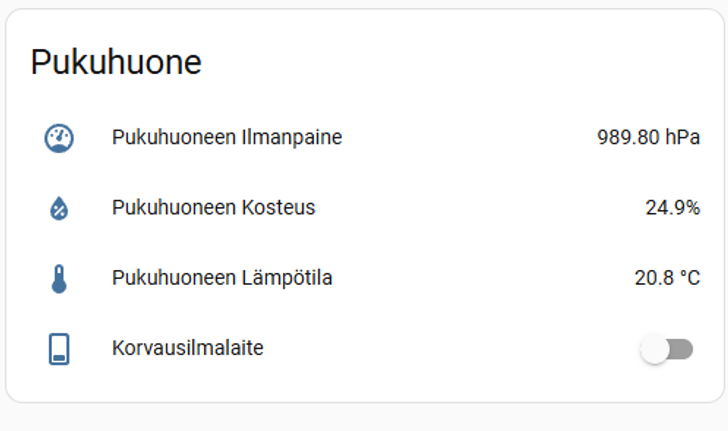
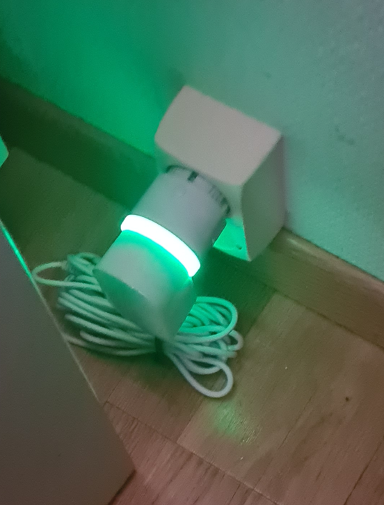
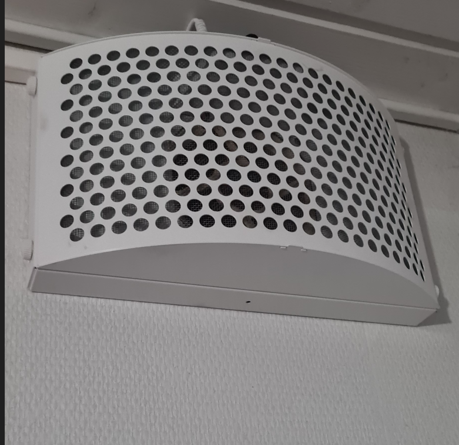

# Korvausilmalaitteen ohjaus kosteusanturin avulla

Talvipakkasilla korvausilmalaite tuo sisään kylmää ilmaa ja lisää energiankulutusta. Halusin ohjata laitetta niin, että se käy vain tarpeen mukaan, eli kun pukuhuoneen kosteus nousee suihkun aikana. Samalla halusin toteuttaa mikrokontrolleri- ja sensoriprojektin, jossa mittausdata ohjaa laitetta ja toiminta on helposti seurattavissa Home Assistantissa.

## Käytetyt teknologiat ja niiden roolit
- **ESP32:** mikrokontrolleri, joka lukee anturin mittausarvot ja lähettää ne eteenpäin järjestelmään automaation käytettäväksi.
- **BME280:** kosteusanturi (sekä lämpötila/paine), jonka mittausten perusteella päätellään milloin pukuhuoneessa on “suihkukosteutta” ja korvausilmalle on tarvetta.
- **MQTT:** viestinvälitysprotokolla, jolla ESP32 lähettää mittausdatan (esim. JSON) keskitetysti Home Assistant -ympäristöön.
- **Home Assistant (HA):** avoimen lähdekoodin kotiautomaatioalusta, johon kosteusanturin mittausdata tuotiin. Lisäksi HA:ssa toteutettiin automaatio, joka ohjaa **Shelly Plug S** -laitetta (korvausilmalaite päälle/pois kosteuden perusteella).
- **Shelly Plug S:** ohjattava pistorasia/toimilaite, jolla korvausilmalaite kytketään päälle tai pois Home Assistantista tulevan ohjauksen perusteella.

## Tulokset

Automaatio toimii käytännössä halutulla tavalla:
- kun pukuhuoneen kosteus nousee (esim. suihkun aikana), korvausilmalaite kytkeytyy päälle
- kun kosteus laskee takaisin, laite sammuu (hystereesi estää sahaamisen)
- turva-ajastin rajoittaa laitteen maksimikäyntiaikaa

  
   
  <em>Home Assistant -dashboard: pukuhuoneen kosteus/lämpötila/paine sekä korvausilmalaitteen tila.</em>

  <figure style="margin:0; text-align:center;">
    
    <figcaption style="min-height:1.6em;"><em>Shelly Plug S toimii toimilaitteena (päälle/pois).</em></figcaption>
  </figure>

  <figure style="margin:0; text-align:center;">
    
    <figcaption style="min-height:1.6em;"><em>Ohjattava korvausilmalaite.</em></figcaption>
  </figure>

